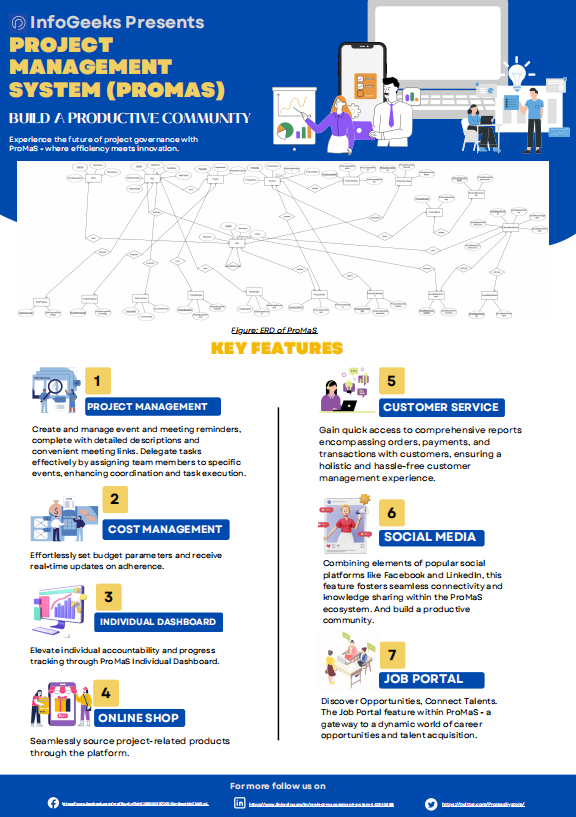

# ProMaS: Project Management System
A comprehensive suite of cutting-edge features meticulously designed to elevate project management to
unparalleled levels of efficiency and effectiveness. Seamlessly integrated within a centralized database,
ProMaS is significant for the diverse needs of modern project management, ensuring meticulous oversight
while fostering collaboration and streamlined communication. This innovative platform empowers project
stakeholders with a range of capabilities, ensuring optimal resource allocation, budget control, and progress
tracking.

## System Diagram

